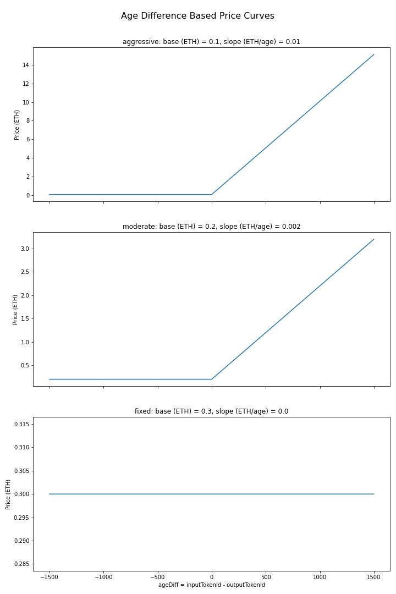

# TimelockNFTSwapper Spec

- [TimelockNFTSwapper Spec](#timelocknftswapper-spec)
  - [Overview](#overview)
  - [Interface](#interface)
    - [`constructor`](#constructor)
    - [Swap Functions](#swap-functions)
      - [`swapPrice`](#swapprice)
      - [`queueSwap`](#queueswap)
      - [`executeSwap`](#executeswap)
    - [Setter Functions](#setter-functions)
      - [`setFeeRecipient`](#setfeerecipient)
      - [`setSwapPriceCurveParams`](#setswappricecurveparams)
      - [`setQueuePeriod`](#setqueueperiod)
  - [Swap Price Curve](#swap-price-curve)
  - [Approval Considerations](#approval-considerations)
  - [Why is the Timelock Required?](#why-is-the-timelock-required)

## Overview

The TimelockNFTSwapper contract enables permissionless timelocked swapping between NFT's within an ERC721 collection. 

This contract is non-upgradable and immutable. No NFTs or funds are ever held by this contract, instead it just facilitates the permissionless swap process. 

The designed use case is for enabling Nounish DAOs to earn revenue by allowing holders to permissionlessly swap their governance NFT for one held within the DAOs Treasury to obtain one that they vibe with most. 

Usage flow:
```mermaid
sequenceDiagram
    actor U as NFT Holder
    participant S as TimelockNFTSwapper
    participant P as Swap Pool
    participant R as Fee Recipient
    activate U
    U->>S: tx: queueSwap
    S-->>R: queue fee (ETH) 
    deactivate U

    Note over U: wait queuePeriod

    activate U
    U->>S: tx: executeSwap
    S-->>R: swap fee (ETH)
    U-->>P: inputNFT
    P-->>U: outputNFT
    deactivate U
```

---


## Interface

### `constructor`

```solidity
constructor(
    IERC721 nft, 
    address swapPool, 
    address feeRecipient, 
    uint256 swapPriceCurveBase,
    uint256 swapPriceCurveSlope,
    uint256 queueFee,
    uint256 queuePeriod,
    uint256 executionGracePeriod,
)
```

* `nft`: the ERC721 token that is being swapped.
* `swapPool`: the address which holds the swappable NFTs, note that the `swapPool` must approve this contract for it's NFTs (or a subset of them, see [Approval Considerations](#approval-considerations)).
* `feeRecipient`: the address where fees will be sent. 
* `swapPriceCurveBase`: parameter for the swap price curve (see [Swap Price Curve](#swap-price-curve)).
* `swapPriceCurveSlope`: parameter for the swap price curve (see [Swap Price Curve](#swap-price-curve)).
* `queueFee`: fee in Wei to queue a swap (used to prevent swap queue spam)
* `queuePeriod`: time in seconds a swap must be queued before it can be executed (see [Why is the Timelock Required?](#why-is-the-timelock-required))
* `executionGracePeriod`: time in seconds before an executable swap will expire 

### Swap Functions

#### `swapPrice`

```solidity
function swapPrice(
    uint256 inputTokenId, 
    uint256 outputTokenId
) view returns (uint256)
```

View function to get the price in Wei to perform a swap from `inputTokenId` NFT to `outputTokenId` NFT based on [swap price curve](#swap-price-curve). This is meant to be used to determine the fee to send when calling `executeSwap`.

#### `queueSwap`

```solidity
function queueSwap(uint256 inputTokenId, uint256 outputTokenId) payable returns (uint256)
```

Queues a swap for the `inputTokenId` NFT from `msg.sender` with the `outputTokenId` NFT from the `swapPool`. Sends the `queueFee` to the `feeRecipient`. Returns the `swapId` for the queued swap which is to be used in `executeSwap` after waiting the `queuePeriod`. 

Requirements:
* `msg.sender` must own the `inputTokenId` NFT. 
* `swapPool` must own the `outputTokenId` NFT.
* This contract must be approved to transfer the `inputTokenId` NFT on behalf of `msg.sender`.
* This contract must be approved to transfer the `outputTokenId` NFT on behalf of the `swapPool`
* `msg.value` must equal `queueFee`. 
* The `inputTokenId` NFT must not be involved in a pending swap.
* The `outputTokenId` NFT must not be involved in a pending swap.

#### `executeSwap`

```solidity
function executeSwap(uint256 swapId) payable 
```

Swaps the `inputTokenId` from `msg.sender` with the `outputTokenId` from the `swapPool` for the corresponding queued `swapId`. Sends the swap fee to the `feeRecipient`.  


Requirements:
* `msg.sender` must be the address that queued the swap with `swapId`.
* `msg.sender` must own the `inputTokenId` NFT. 
* `swapPool` must own the `outputTokenId` NFT.
* This contract must be approved to transfer the `inputTokenId` NFT on behalf of `msg.sender`.
* This contract must be approved to transfer the `outputTokenId` NFT on behalf of the `swapPool`
* The swap with `swapId` must have been previously queued, and gone through the `queuePeriod`
* The queued swap must not be expired (waited more than `executionGracePeriod` after it became executable)
* `msg.value` must equal `swapPrice(inputTokenId, outputTokenId)` 

### Setter Functions

`msg.sender` must be the `owner` to call any setter function.

#### `setFeeRecipient`

```solidity
function setFeeRecipient(uint256 feeRecipient_) 
```

Sets the fee recipient.

#### `setSwapPriceCurveParams`

```solidity
function setSwapPriceCurveParameters(uint256 swapPriceCurveBase_, uint256 swapPriceCurveSlope_)  
```

Sets the price curve parameters.

#### `setQueuePeriod`

```solidity
function setQueuePeriod(uint256 queuePeriod_) 
```

Sets the queue period.

## Swap Price Curve 

The swap price is based on the difference between the `inputTokenId` and `outputTokenId` and is determined by the curve below. This price curve values every input and output NFT distinctly to help preserve non-fungibility. 

```python
ageDiff = inputTokenId - outputTokenId
price = swapPriceCurveBase + swapPriceCurveSlope * max(0, ageDiff)
```

The plot below shows examples of a few different parameter sets:



## Approval Considerations

As mentioned above, the `swapPool` must approve this contract to transfer any NFTs which are desired to be available for swapping. The easiest option is to `setApprovalForAll` to make all NFTs held by the `swapPool` available. 

An alternative is to restrict the swappable NFTs to a subset of those held in the `swapPool` by individually approving using `nft.approve`. When using individual approvals, every swap will reduce the swappable number of NFTs by one. This means that batch approvals will likely need to continue to happen over time to "refill" the swappable NFTs. 

## Why is the Timelock Required?

NFTs which are approved for swapping can still be used by the `swapPool` for other things. But, if the `swapPool` is a treasury with some timelock (like in Nouns), and a proposal is trying to move an NFT which is also approved for swapping, then a malicious actor could block this by swapping for that NFT before the proposal execution occurs, thus making the execution fail when it's attempted. 

This issue is avoided by using a separate timelock in the TimelockNFTSwapper with a `queueTime` set higher than the total proposal time of the DAO (voting delay + voting period + execution delay).

